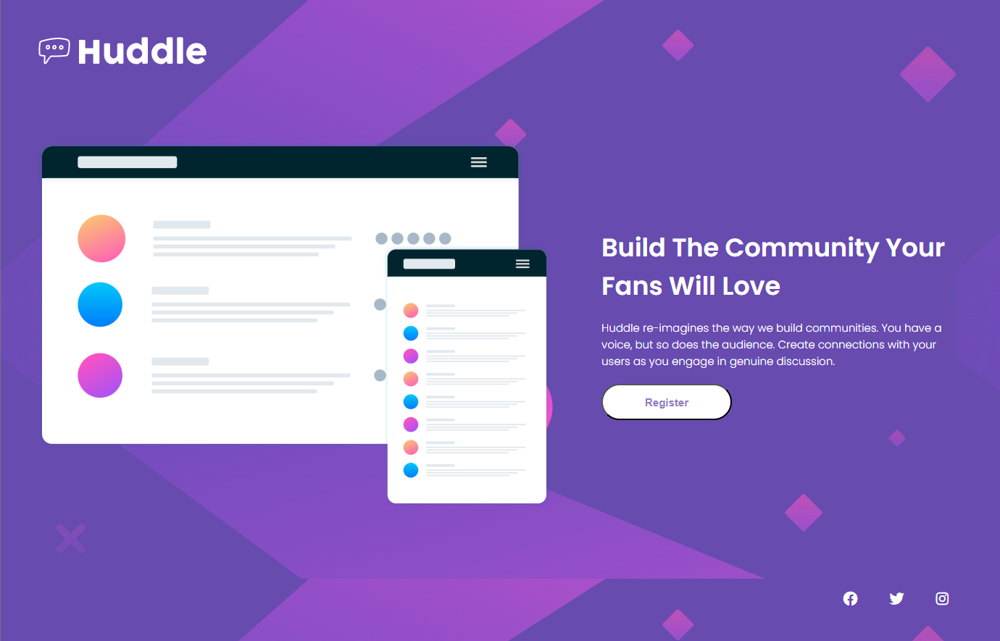
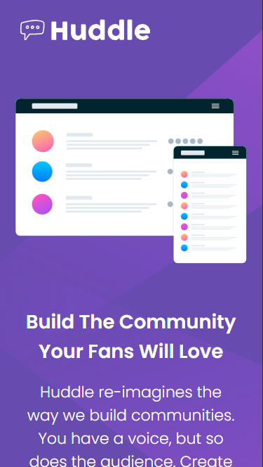

# Huddle Landing Page - Single Introductory Section

Este projeto é uma recriação do desafio **"Huddle landing page with single introductory section"** do [Frontend Mentor](https://www.frontendmentor.io/), desenvolvido como parte do curso de **Desenvolvimento FullStack** (módulos HTML e CSS).  
O objetivo foi praticar **estruturação semântica em HTML**, **estilização com CSS**, **responsividade** e **boas práticas de flexbox**.

---

## 📌 Índice

- [Visão Geral](#visão-geral)
- [Tecnologias Utilizadas](#tecnologias-utilizadas)
- [Funcionalidades](#funcionalidades)
- [Responsividade](#responsividade)
- [Como Executar o Projeto](#como-executar-o-projeto)
- [Screenshots](#screenshots)
- [Licença](#licença)

---

## 🔍 Visão Geral

A página apresenta uma **seção introdutória única** para a plataforma fictícia **Huddle**, que visa ajudar a construir comunidades online.  
O design segue um **layout moderno e limpo**, com uso de **cores vivas** e **elementos vetoriais**.  
Foi aplicado o conceito **desktop-first** na estilização responsiva.

---

## 💻 Tecnologias Utilizadas

- **HTML5** → Estrutura e semântica
- **CSS3** → Estilização e responsividade
- **Flexbox** → Layout e alinhamento
- **Google Fonts** → Tipografia (`Poppins` e `Open Sans`)
- **Font Awesome** → Ícones de redes sociais
- **Favicon** → Ícone da aba do navegador

---

## ✨ Funcionalidades

- Layout com **flexbox** para alinhamento responsivo.
- **Botão interativo** com efeito hover.
- **Ícones de redes sociais** com efeito ao passar o mouse.
- **Tipografia personalizada** com Google Fonts.
- **Imagens otimizadas** para desktop e dispositivos móveis.

---

## 📱 Responsividade

- **1025px ou menos** → Ajuste para telas de tablets.
- **745px ou menos** → Layout adaptado para smartphones, com fontes e espaçamentos otimizados.
- Mudança na **orientação dos elementos** (de lado a lado para empilhados).

---

## 🚀 Como Executar o Projeto

1. **Clonar o repositório**

   git clone https://github.com/seu-usuario/huddle-landing-page.git

---

## 📷 Screenshots

---

## 📄 Licença

Este projeto foi desenvolvido para fins educacionais.
O design é baseado no desafio gratuito do Frontend Mentor.
Sinta-se à vontade para modificar e reutilizar o código.